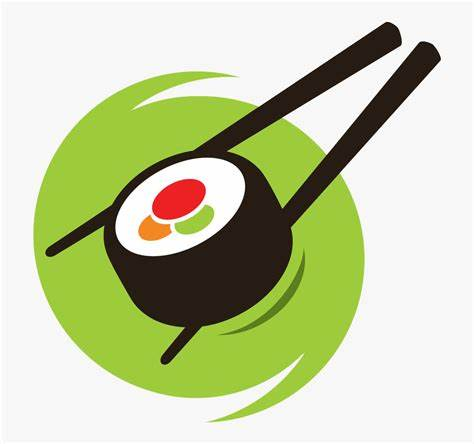
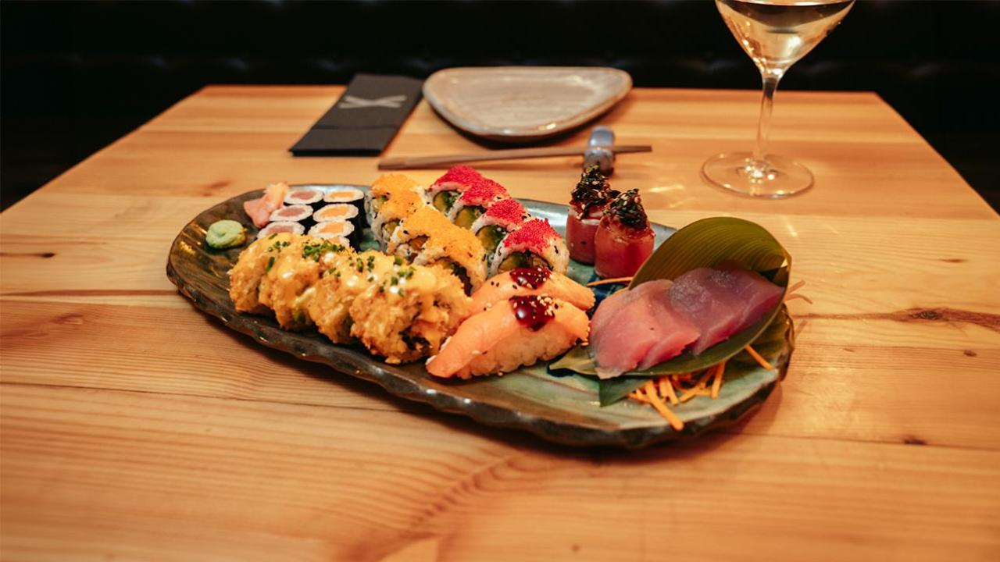

## RESTAURANT JAPONSUSHI EXPRESS
Es un nuevo restaurante donde ofrencen variedad de comida asiática. Podemos ver una galería de algunos de nuestros platillos, una página de contacto para realizar la reservación nuestro menú y la página principal.

## USO 
Al ingresar en la página web del Restaurante JaponSushi Express, se encuentran tres secciones a las que se puede acceder fácilmente haciendo clic en cada una de ellas. Dado que es un restaurante nuevo, solo posee un único establecimiento.

##  TEGNOLOGÍA UTILIZADAS
- Html 
- Css
- Bootstrap 

## CRÉDITOS 

-  El diseño de la interfaz fue creado por mí, Astrid. 
- Las imágenes se obtuvieron de varias fuentes, pero la mayoría fueron recopiladas del Restaurante Subaya.

## CONTACTO 
Si tienen alguna pregunta, no duden en contactarnos: astridviloria@gmail.com

#   Restaurante Digital JaponSushi Express  

Este proyecto tiene como objetivo diseñar y crear la página web para un restaurante, aplicando los conocimientos adquiridos en HTML5, CSS3, CSS Layout (Flexbox & Grid) y utilizando componentes de Bootstrap. La página web constará de cuatro páginas hipervinculadas mínimas: Inicio, Carta, Contacto y galeria .

## 📑 Descripción del Proyecto 📑

El proyecto constará de las siguientes vistas mínimas:

-  Vista inicio: En esta sección,  Tendra una breve introducción sobre el restaurant  y se mostrara algunas imagenes 

-  Vista Carta: Aquí se mostrarán los diferentes platillos junto con sus precios.

-  Vista Contacto: En esta página se proporcionará un formulario para que los clientes puedan contactar con la empresa y a su vez poder realizar su reserva.

## ⌨️ Tecnologías Utilizadas ⌨️

Para el desarrollo del proyecto se utilizarán las siguientes tecnologías:

-  : Para la estructura y el contenido de las páginas web.
  
-  : Para el diseño y la presentación visual de las páginas.

-  : Se incluirán componentes de Bootstrap para agilizar el desarrollo y garantizar la consistencia en el diseño.

